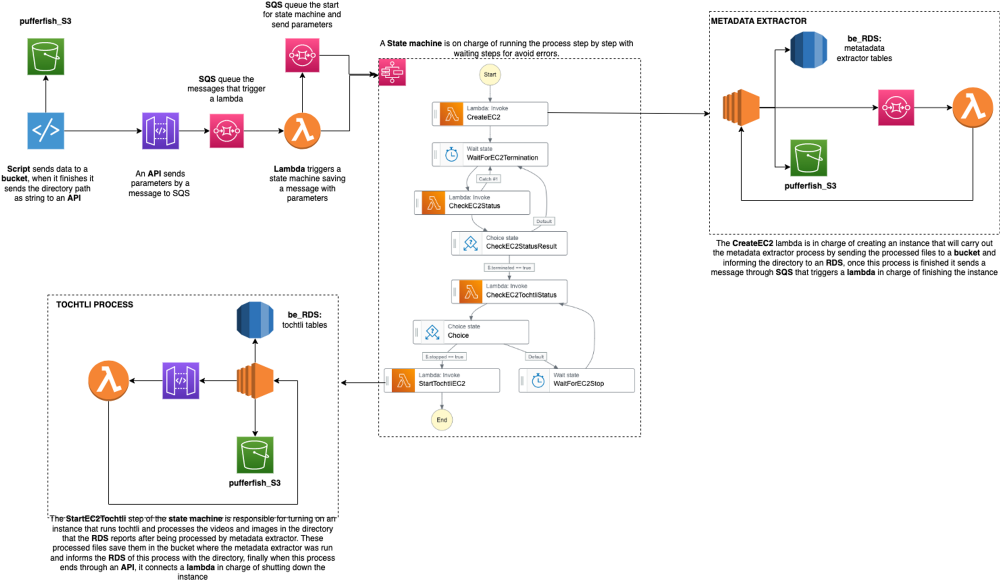

# Intro

Pufferfish is the name of the system responsible for carrying out the process of data collection, metadata extraction, and processing.

The following figure shows the flow of the services where, after uploading the data to a bucket through a script, different connections are made through the lambda, sqs, and step functions services in order to carry out the processes of receiving, extracting, and processing the files of arrival.

## Pufferfish Steps

1. A script in charge of uploading the field data to a bucket in S3 is run. When the data is finished uploading, a reference is made to an API Gateway, sending it the directory path where the files were uploaded as a string parameter.

2. The directory path is queued via SQS to trigger a lambda.

3. Lambda processes the SQS message with the parameters and enqueues them in another SQS so that later they are received by an instance in charge of running a certain process. Finally, lambda starts a Step Functions process by turning on a state machine.

4. A state machine is in charge of running the processes of metadata extraction and processing of received images, videos, and audio by means of orchestrating the instances in which said processes are run and managing the flow of these through protocols for waiting and review of instances statuses via lambdas.

    1. CreateEC2: Lambda creates an instance through a template in charge of running the metadata extraction from the files, processing the SQS message with the address of the S3 bucket where the data is located. This process happens with a script using the user data from the template where the metadata extraction is uploaded to a path in S3 and the directory of the data moved to an RDS is inserted as well as the directories that could not be moved with error type labels. Finally, when the script finishes running, it sends a message to SQS with the ID of the instance where the process was run, so that this message triggers a lambda in charge of terminating that instance.

    2. WaitForEC2Termination: State of waiting for the termination of the previous instance.

    3. CheckEC2Status: Lambda in charge of reviewing the status of the previous instance.

    4. CheckEC2StatusResult: State that determines whether to proceed to the next state machine step or continue to wait depending on the response from the previous lambda.

    5. CheckEC2TochtliStatus: Lambda in charge of reviewing the status of a certain instance.

    6. Choice: Depending on the previous lambda, if the state of the instance is stopped, it continues with the next lambda, otherwise it sends the process to a waiting state.

    7. WaitForEC2Stop: State of waiting for a certain time to ask again the status of the instance.

    8. StartTochtliEC2:Lamba in charge of turning on an already existing instance that performs the processing of images, videos and audio consulting the RDS the metadata directory extracted by the process of the previous instance, this directory is the one that is processed, uploading the files to the path of that S3 and registering said directory in another RDS table. Once this process ends through a script using the user data of the instance that runs each time it is initialized, an API Gateway is consulted in charge of triggering a lambda to stop the instance.

## Requirements

- RDS

- S3 bucket directory 

- Lambda

- EC2

- API Gateway

- State Machine

:::note Lambda
Needs access to receive and write SQS messages.
Permission to start, stop, describe, and terminates instances
:::

:::note EC2
Needs access to S3 bucket directory.
Access to receive and write SQS messages
:::

:::note API Gateway
Needs access to receive and write SQS messages
:::

## AWS Services Glossary

:::info
simex will be superseded by beadmex
:::

|   Service  | 	   Name	     |  Expected Results |
|:----------:|:-------------:|------------------:|
| API	| pufferfish-api	| After the data load an APIGATEWAY pufferfish-api is called using the resource of sending a message to an SQS
| SQS	| apigatewaysqs	| Enqueues parameters to trigger lambda
| Lambda	| pufferfish-message-tigger	| Receives parameters that are sent to a queue so that they are received by an instance and is in charge of starting the state function pufferfish-step-machine
| SQS	| parameters-sqs	| Contains the parameters that will be read by the instance that is created
| Step Function	| pufferfish-step-machine	| It runs a process made up of a set of lambdas in charge of running the tochtli and simex processes in parallel if other processes are found in the queue with waiting states.
| Lambda	| pufferfish-create-extractor-ec2	| Create the simex instance from a template, reading the directory messages with the parameters-sqs queue
| EC2	| simex-ec2-ip	| Run simex and send the change files to S3 writing the directory move on test-simex RDS
| SQS	| terminate-instance.fifo	| Receive the instance_id of simex-ec2-ip once the process ends
| Lambda	| pufferfish-wait-status	| Check the status of the instance that simex runs to continue with the process once it is finished
| Lambda	| pufferfish-terminate-simex	| Terminate simex instance triggered by terminate-instance.fifo
| Lambda	| pufferfish-tochtli-process-check	| Check the status of the tochtli-process instance, since if it is not stopped it has to wait until it is stopped to continue with the process.
| Lambda	| pufferfish-start-tochtli-process	| Start the instance tochli-process
| EC2	| tochli-process	| Run Tochtli process in charge of change video and audios, previously loaded by simex, send changed directory to test-simex RDS
| API	| pufferfish-api	| When EC2 tochtli process ends it calls and APIGATEWAY that trigger pufferfish-stop
| Lambda	| puffefish stop	| Stop tochtli-process EC2